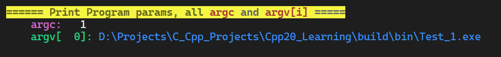

# cutil

> A **HEADER FILE** project with useful macros and template functions for C/C++.
> **一个只有头文件的，有许多实用宏和函数的 C/C++ 轮子库**

**Homepage**: [https://github.com/BH2WFR/cutil](https://github.com/BH2WFR/cutil)
**Author**: BH2WFR
**LICENSE**: **MIT** License **(except extern codes)**

Reference of Ansi Escape Codes:

- [https://en.wikipedia.org/wiki/ANSI_escape_code](https://en.wikipedia.org/wiki/ANSI_escape_code)
- [https://zh.wikipedia.org/wiki/ANSI%E8%BD%AC%E4%B9%89%E5%BA%8F%E5%88%97](https://zh.wikipedia.org/wiki/ANSI%E8%BD%AC%E4%B9%89%E5%BA%8F%E5%88%97)

### Included Following External Header-Only Libraries & credits to:

| **name**    | **author**     | **link**                                 | **path**                | **license** |
| :---------- | :------------- | :--------------------------------------- | ----------------------- | :--------- |
| **scope_guard** | ricab      | https://github.com/ricab/scope_guard | `External/ScopeGuard.hpp` | Unlicense |
| **xorstr**  | JustasMasiulis | https://github.com/JustasMasiulis/xorstr | `External/XorStr.hpp` | Apache 2.0 |
| **span**    | tcbrindle  | https://github.com/tcbrindle/span    | `External/Span.hpp`   | BSL 1.0 |
| **strutil** | Shot511    | https://github.com/Shot511/strutil   | `External/StrUtil.h` | MIT    |
| **magic_enum** | Neargye        | https://github.com/Neargye/magic_enum | `External/MaginEnum/*.h` | MIT|

----------

### NOTICE:

- namespace of this library is `cutil::`, and it has a shorter alias `cu::`.
    if you want to disable shorter alias namespace `cu::`, add `#define CUTIL_PARAM_USE_SHORTEN_NAMESPACE = 1` before including headers, then you can only use by `cutil::`.
    本库的命名空间为 `cutil::`，且有一个叫 `cu::` 的简称。在引用本库头文件前，加入 `#define CUTIL_PARAM_USE_SHORTEN_NAMESPACE = 1`，可以停止使用 `cu::` 简称，只能用 `cutil::` 访问本库。
- features using ANSI Escape code (like color customizing, or cursor moving macros in this header file) **DO NOT SUPPORT Windows version lower than Windows 10 1511**, otherwise it can't display properly in windows cmd.
    ANSI Escape Code 不支持 Windows 10 1511 以下的 Windows 版本，否则无法在 CMD 中正常显示。

    - If you are using these operating systems, pls `#define CONSOLE_UTIL_ANSI_ESCAPE_UNSUPPORTED  1` before `#include <cutil/console_utils.h>` to disable features by printing Ansi Escape Code.
- C language version `≥ C99`, C++ language `≥ C++14` (≥C++17 recommended)  , with `##__VA_ARGS__` extension support.
    C 语言标准最低 C99, C++ 标准最低 C++14 (推荐 ≥C++17), 且有 `##__VA_ARGS__` 编译器扩展 (VS2015 Update 3 后支持此扩展)

    (**MSVC supports `##__VA_ARGS__` since VS2015 Update 3**. if your MSVC or VS version is older, pls delete "`##`", MSVC eats trailing comma before `__VA_ARGS__` by default without `/Zc::preprocessor` command)

- **UTF-8 encoding REQUIRED** for C++ compiler. pls add `/utf-8` compiler argument for MSVC.
  如果使用 C++, 强制要求编译器使用 UTF-8 编码. 如果使用的是 MSVC 编译器, 请加入 `/utf-8` 编译参数

- Pls #include this header **after other header files,** especially those from libraries such as Qt/fmtlib, or OS API headers like `<windows.h>`/`<unistd.h>`. DO NOT #include <`cutil/console_utils.h`> in header files.
- `#define CUTIL_ANSI_ESCAPE_UNSUPPORTED  1` **BEFORE** include of this header may turn off all the features with ANSI Escape Code.
- `#define CUTIL_FORCE_FUNCTION_STATIC 1` **BEFORE** include of `CppUtil.hpp` may let all the inline functions to be `static inline`
- `#define CUTIL_FORCE_UTF8  0` **BEFORE** include may turn off UTF-8 literal encoding checking (C++ Only). By Default, **if you are using MSVC, `/UTF-8` compiler param is REQUIRED**.

----------

## \<cutil/cpp_utils.hpp\>

### Comparing Expressions Generator 比较表达式生成器

- **cutil\:\:equal_any(...)**: `(compared == arg1 || compared == arg2 || compared == arg3 || ...)`
  **cutil\:\:equal_all(...)**: `(compared == arg1 && compared == arg2 && compared == arg3 && ...)`
  **cutil\:\:unequal_all(...)**: `(compared != arg1 || compared != arg2 || compared != arg3 || ...)`
  **cutil\:\:uniqual_any(...)**: `(compared != arg1 && compared != arg2 && compared != arg3 && ...)`
  **后续参数**与**第一个参数**，**有相等的**？全部相等？有不等的？**全部不等**（不是互不相等）？

  ```c++
  int var = 10;
  if(cutil::equal_any(var, 2, 4, 6, 8, 10)){
    // equivalent to `if(var == 2 || var == 4 || var == 6 || var == 8 || var == 10)`
    // equivalent to `if(!CUTIL_UNEQUAL_ALL(var, 2, 4, 6, 8, 10))`
  }
  if(cutil::equal_all(var, 2, 4, 6, 8, 10)){
    // equivalent to `if(var == 2 && var == 4 && var == 6 && var == 8 && var == 10)`
    // equivalent to `if(cutil::equal_mutually(var, 2, 4, 6, 8, 10))`
    // equivalent to `if(!cutil::unequal_any(var, 2, 4, 6, 8, 10))`
  }
  if(cutil::unequal_all(var, 2, 4, 6, 8, 10)){
    // equivalent to `if(var != 2 && var != 4 && var != 6 && var != 8 && var != 10)`
    // equivalent to `if(! cutil::equal_any(var, 2, 4, 6, 8, 10))`
  }
  if(cutil::unequal_any(var, 2, 4, 6, 8, 10)){
    // equivalent to `if(var != 2 || var != 4 || var != 6 || var != 8 || var != 10)`
    // equivalent to `if(! cutil::equal_all(var, 2, 4, 6, 8, 10))`
  }
  ```

- **cutil\:\:unequal_mutually(...)**: check if variables are mutually different.  **互不相等**

  > **If's recommended to use std::set<> if number of arguments is more than 5**. 参数在 5 以上，推荐使用 std::set<>

  **cutil\:\:equal_mutually(...)**: equivalent to `cutil::equal_all(a1, a2, a3, a4, a5)` **互相相等**

  ```c++
  if(cutil::unequal_mutually(a1, a2, a3, a4);){ // is `a1`, `a2`, `a3`, `a4` mutually different?
      // (  ((a1) != (a2) && (a1) != (a3) && (a1) != (a4))
      // && ((a2) != (a3) && (a2) != (a4))
      // && ((a3) != (a4))   )
  }
  if(cutil::equal_mutually(a1, a2, a3, a4, a5)){
      // ((a1) == (a2) && (a1) == (a3) && (a1) == (a4) && (a1) == (a5))
      // equivalent to `if(cutil::equal_all(a1, a2, a3, a4, a5))`
  }
  ```

- **cutil\:\:increasing(...)**: `(a1 < a2 && a2 < a3 && ...)` **递增序列**
  **cutil\:\:decreasing(...)**: `(a1 > a2 && a2 > a3 && ...)` 递减序列
  **cutil\:\:increasing_equal(...)**: `(a1 <= a2 && a2 <= a3 && ...)` **递增（可相等）序列**
  **cutil\:\:decreasing_equal(...)**: `(a1 >= a2 && a2 >= a3 && ...)` **递减（可相等）序列**

  ```c++
  constexpr bool b1 = cutil::increasing(1, 2, 3, 4, 5); // true
  constexpr bool b2 = cutil::increasing(1, 2, 3, 3, 5); // false
  constexpr bool b3 = cutil::decreasing(5, 4, 3, 2, 1); // true
  constexpr bool b4 = cutil::decreasing(5, 4, 3, 3, 1); // false
  constexpr bool b5 = cutil::increasing_equal(1, 2, 3, 3, 5); // true
  constexpr bool b6 = cutil::decreasing_equal(5, 4, 3, 3, 1); // true
  ```

### Enum Utils 枚举实用工具

- **cutil\:\:enum_int(enum_value)**
  convert enum type to **underlying integer type**:
  将枚举值 转化为 **该枚举类型对应的底层整型**
  
  ```c++
  enum class MyEnum : uint8_t {
      None = 0,
      Flag1 = 1 << 0, // 0b00000001
      Flag2 = 1 << 1, // 0b00000010
      Flag3 = 1 << 2, // 0b00000100
      Flag4 = 1 << 3, // 0b00001000
  };
  // convert enum to its underlying integer type
  uint8_t value = cutil::enum_int(MyEnum::Flag1); // uint8_t, 0b00000011
  ```
  
- **namespace cutil\:\:enum_bitwise**
  **bitwise operations overloading** for **enum class**:
  针对 **enum class** 的**位运算重载**:

  ```c++
  using namespace cutil::enum_bitwise; // you must include this namespace to use bitwise operators
  auto flag  = MyEnum::Flag1 | MyEnum::Flag2;
  auto flag2 = MyEnum::Flag1 & MyEnum::Flag2;
  auto flag3 = MyEnum::Flag1 ^ MyEnum::Flag2;
  auto flag4 = ~MyEnum::Flag1;
  flag |= MyEnum::Flag2;
  flag &= MyEnum::Flag3;
  flag ^= MyEnum::Flag4;
  ```

### Convert Between Overload Functions 重载函数的函数指针转换

- **cutil\:\:overload<...>(&function)**
  for **non-member functions**, **static member functions** or **member functions without const overload**
  非成员函数、静态成员函数、没有 const 重载的成员函数
  
  > referenced from qOverload<>() | 借鉴自 qOverload<>()
  
  ```c++
  class ConvertTestClass{
  public:
    int func()                              {return 0;}
    int func(int i)                         {return 1;}
    int func(double i)                      {return 2;}
    int func(int i, double d)               {return 3;}
    int func()                     const    {return 4;} // with const/non-const overload
    int func(int i)                const    {return 5;}
    int func(double i)             const    {return 6;}
    int func(int i, double d)      const    {return 7;}
    static int static_func()                {return 8;} // non-member function
    static int static_func(int i)           {return 9;}
    static int static_func(double i)        {return 10;}
    static int static_func(int i, double d) {return 11;}
    int func2()                             {return 12;} // without const/non-const overload
    int func2(int i)                        {return 13;}
    int func2(double i)                     {return 14;}
    int func2(int i, double d)              {return 15;}
  };
  ConvertTestClass c;
  const ConvertTestClass cc;
  
  // gtest codes, it means to check if right expression equals to left expresson
  EXPECT_EQ(8, cutil::overload<>(&ConvertTestClass::static_func)());
  EXPECT_EQ(9, cutil::overload<int>(&ConvertTestClass::static_func)(1));
  EXPECT_EQ(10, cutil::overload<double>(&ConvertTestClass::static_func)(1.0));
  EXPECT_EQ(11, (cutil::overload<int, double>(&ConvertTestClass::static_func)(1, 1.0)));
  
  EXPECT_EQ(12, (c.*cutil::overload<>(&ConvertTestClass::func2))());
  EXPECT_EQ(13, (c.*cutil::overload<int>(&ConvertTestClass::func2))(1));
  EXPECT_EQ(14, (c.*cutil::overload<double>(&ConvertTestClass::func2))(1.0));
  EXPECT_EQ(15, (c.*cutil::overload<int, double>(&ConvertTestClass::func2))(1, 1.0));
  ```
  
- **cutil\:\:const_overload<...>(&function)**
  **cutil\:\:non_const_overload<...>(&function)**
  for **member functions with const overload**
  有 const 重载的成员函数
  
  ```c++
  EXPECT_EQ(0, (c.*cutil::non_const_overload<>(&ConvertTestClass::func))());
  EXPECT_EQ(1, (c.*cutil::non_const_overload<int>(&ConvertTestClass::func))(1));
  EXPECT_EQ(4, (cc.*cutil::const_overload<>(&ConvertTestClass::func))());
  EXPECT_EQ(5, (cc.*cutil::const_overload<int>(&ConvertTestClass::func))(1));
  ```

### Type Conversions 类型转换

- **cutil\:\:bit_cast\<T\>**(var): bit_cast for C++14/17 |  针对 C++14/17 的 bit_cast (按位转换)

  > redirects to std::bit_cast<> since C++20, and it's constexpr   | C++20 起重定向到 constexpr 的 std::bit_cast
  > uses memcpy in C++14/17, so not constexpr  | C++14/17 中, 利用 memcpy 来实现转换, 不是 constexpr

- **cutil\:\:bitwise_memcpy\<Out, In\>(out, in)**:

  ```c++
  cutil::bitwise_memcpy(f, i)         // i -> f, bitwise memcpy
  f = bit_cast<float>(i);             // equivalent
  f = *reinterpret_cast<volatile float*>(&i); // equivalent
  std::memcpy(&f, &i, sizeof(f));     // equivalent
  f = std::bit_cast<float>(i)         // C++20
  ```

- **cutil\:\:safe_cast\<T\>(base)**: do `dynamic_cast` in DEBUG, ; do `static_cast` in RELEASE, used for conversion from base class ptr to derived class ptr

  在 DEBUG 模式下映射到 dymanic_cast, 而在 RELEASE 模式下映射到 static_cast, 用于基类指针向派生类的转换

### Memory Operations 内存操作

- **cutil\:\:midpoint(ptr1, ptr2)**: get midpoint of two pointers. | 两个指针之间的中点地址

- **cutil\:\:get_ptr_offset(ptr1, ptr2)** : offset of two member variables | 两个成员指针之间的差值

- **cutil\:\:get_member_offset(ptr)** : offset of the member variable in struct/class | 成员距离其所在结构体/类的偏移量

  ```c++
  struct S { int a; int b; };
  ptrdiff_t offset = cutil::memory::get_member_offset(&A::b); // offset of b in struct S
  S s;
  ptrdiff_t offset = cutil::memory::get_ptr_offset(&s.a, &s.b); // offset of two pointers
  ```

- cutil\:\:read_memory\<T\>(ptr)
  cutil\:\:write_memory\<T\>(ptr, val)

- cutil\:\:memcpy_type
  cutil\:\:memmove_type
  cutil\:\:memset_type
  cutil\:\:memcmp_type
  cutil\:\:malloc_type
  cutil\:\:calloc_type
  cutil\:\:realloc_type
- cutil\:\:free_ptr : free()/delete/delete[] a pointer and set to nullptr
  cutil\:\:delete_ptr
  cutil\:\:delete_array

### Range Statements

- Iterator Expression Generator

  ```c++
  #define CUTIL_IT_RANGE(_container)    (_container).begin(), (_container).end()
  #define CUTIL_CTI_RANGE(_container)   (_container).cbegin(), (_container).cend()
  #define CUTIL_RIT_RANGE(_container)   (_container).rbegin(), (_container).rend()
  #define CUTIL_CRIT_RANGE(_container)  (_container).crbegin(), (_container).crend()
  std::vector<int> vec(10);
  std::iota(CUTIL_IT_RANGE(vec), 0); // fill vec with 0 to 9
  ```

- **cutil\:\:contains(container, value)**: wrapper of std\:\:find and  std\:\:find_if, without typing `.begin()` and `.end()`
  **cutil\:\:contains_if(container, pred)**

  ```c++
  std::vector<int> vec = {1, 2, 3, 4, 5};
  if(cutil::contains(vec, 3)){}
  if(cutil::contains(std::execution::par_seq, vec, 3)){} // C++17
  if(cutil::contains_if(vec, [](int i){return i == 3;})){}
  if(cutil::contains_if((std::execution::par_seq, vec, [](int i){return i == 3;})){} // C++17
  ```

- **cutil\:\:erase_vector(container, value)**: combination of  std\:\:remove and  .erase() for std\:\:vector and  std\:\:deque, to erase a value

  ```c++
  std::vector<int> e1 = {1, 2, 2, 4, 2, 5, 4};
  size_t removed = cutil::erase_vector(e1, 2); // 3
  removed = cutil::erase_if_vector(e1, [](int i){return i == 4;}); // 2
  e1.clear();
  removed = cutil::erase_vector(e1, 6); // 0
  ```

----------

## \<cutil/cpp_math.hpp\>

- **cutil\:\:numbers\:\:___
  cutil\:\:Numbers\<T\>\:\:**___
  Mathematical Constants** like `pi` for C++14/17, similar as `std::numbers` in C++20
  针对 C++14/17 的**数学常量**, 与 C++20 中的 std\:\:numbers 类似

  ```c++
  float       pi      = cutil::numbers::pi_f;
  double      pi      = cutil::numbers::pi;
  long double pi_ld   = cutil::numbers::pi_ld
  float       pi      = cutil::Numbers<float>::pi;
  double      pi      = cutil::Numbers<double>::pi;
  long double pi_ld   = cutil::Numbers<long double>::pi
  ```

- **cutil\:\:fequal_eps(a, b, eps)**
  **cutil\:\:fequal_ulp(a, b, ulp)**
  **cutil\:\:fequal_zero(a)**
  compare if two **floating numbers** could be regarded as equal by **epsilon** or **ULP**
  基于 epsilon 或 ULP 方法比较两个浮点数是否可被认作相等

  > available to use `fequal_eps` or  `fequal_zero` if compared number is near zero, otherwise recommended to use `fequal_ulp`
  > 当被比较浮点数接近 0 时, 可用 `fequal_eps` 或 `fequal_zero`, 否则建议使用 `fequal_ulp`.
  > `fequal_ulp` for `long double` is not tested for Linux, BE CAREFUL BEFORE USING. (long double is 8 bytes in windows, and 16 bytes in Linux)
  > 针对 `long double` 的 `fequal_ulp` 尚未在 Linux 中测试, 使用前请注意 (long double 在 windows 中为 8 字节, 在 linux 中为 16 字节)
  > `fequal_ulp` is not constexpr.

- **cutil\:\:pow(num, exp_int)**
  **cutil\:\:pow<exp_int>(num)**   `C++17`
  power of a number, **with integer exponent**, unwrap to multiply itself for times.
  指数为整数的乘方, 展开为多次自身相乘

  > exponent number could be template argument since C++17, and it is recommended
  > 指数从 C++ 17 起可作为模板参数, 且推荐这样的写法
  > `std::pow` is for floating number exponents, sometimes it is inefficient if exponent is an integer and not too large
  > 标准库的 `std::pow` 是针对浮点数指数, 当指数为较小的整数时并不高效
  > referenced from  [](https://stackoverflow.com/questions/1505675/power-of-an-integer-in-c)

  ```c++
  int ret = cutil::pow(2, 3); // generates `2*2*2`, 2^3 = 8
  int ret = cutil::pow<3>(2); // generates `2*2*2`, 2^3 = 8, >=C++17
  ```

- **cutil\:\:deg2rad(deg)**
  **cutil\:\:rad2deg(rad)**
  convert an angle between **deg** and **rad** | **角度弧度互转**

  ```c++
  double a = cutil::deg2rad(30.0);
  EXPECT_EQ(true, cutil::fequal_ulp(a, cutil::numbers::pi / 6.0));
  ```

- **cutil\:\:lerp(a, b, t)**

  Linear Interpolation `(a + (b-a) * t)` for C++14/17 |  针对 C++14/17 的线性插值

  > (redirects to `std::lerp` since C++20).
  > t should be in the range [0, 1]. if t = 0, returns a; if t == 1, returns b.
  > if t is out of range [0, 1], the behavior is undefined.

  ```c++
  EXPECT_EQ(true, (cutil::fequal_ulp(17.5, cutil::math::lerp(10, 20, 0.75))) );
  EXPECT_EQ(true, (cutil::fequal_ulp(20.0, cutil::math::lerp(10, 20, 1.0))) );
  EXPECT_EQ(true, (cutil::fequal_eps(10.0, cutil::math::lerp(10, 20, 0.0), 1e-14))) );
  ```
  
- **cutil\:\:cmp_equal(a, b)**
  **cutil\:\:cmp_not_equal(a, b)**
  **cutil\:\:cmp_less(a, b)**
  **cutil\:\:cmp_less_equal(a, b)**
  **cutil\:\:cmp_greater(a, b)**
  **cutil\:\:cmp_greater_equal(a, b)**
  SAFE signed/unsigned interger comparison for C++14/17
  安全的有符号/无符号整数比较函数 (C++14/17)
  
  > redirects to std::cmp_equal, std::cmp_less, ... since C++20.
  
  ```c++
  bool cmp;
  cmp = cutil::cmp_less(-1, 1U);           // true
  cmp = cutil::cmp_less_equal(-1, 1u);     // false
  cmp = cutil::cmp_greater(-1, 1u);        // false
  cmp = cutil::cmp_not_equal(-1, 0xFFFFFFFFu); // true
  ```
  
- **cutil::in_range\<T\>(a)**
  check if a value is within the range of a integer type for C++14/17
  检查某个数值是否在某个整数型的可表示范围内 (C++14/17)
  
  > will be redirected to std::in_range since C++20.
  
  ```c++
  bool a = cutil::in_range<size_t>(-1); // false
  bool b = cutil::in_range<int>(-1); // true
  bool c = cutil::in_range<unsigned int>(-1); // false
  static_assert(cutil::in_range<size_t>(999), "999 is in range of size_t");
  ```
  
- **cutil\:\:midpoint(a, b)**
  midpoint of two integer or floating point numbers for C++14/17
  获取两个整数或浮点数的中间值 (针对 C++14/17)

  > redirects to `std::midpoint` since C++20.

  ```c++
  EXPECT_EQ(cutil::math::midpoint(6.0, 9.0), 7.5);
  EXPECT_EQ(cutil::math::midpoint(6, 9), 7);
  ```
  
- **cutil\:\:gcd(a, b)**
  **cutil\:\:lcm(a, b)**
  Greatest Common Divisor (GCD), and Lease Common Multiple (LCM) for C++14
  针对 C++14 的最大公因数, 最小公倍数

  > (redirects to `std::gcd` and `std::lcm` since C++17).

- **cutil\:\:clamp(var, min, max, comp)**
  clamp the value between a range for C++14
  将一个值 "夹" 在上下范围之间, 针对 C++14

  > redirects to `std::clamp()` since C++17

  ```c++
  int a = 35, b = 26, c = 19, d = 35;
  d = std::clamp(d, 20, 30);          // C++17, equivalent to above
  d = cutil::math::clamp(d, 20, 30);  // C++14, equivalent to above
  d = cutil::math::clamp(d, 20, 30, std::less<int>()); // equivalent to above
  ```

- **cutil\:\:factorial(num)** :
  factorial of an integer | 整数的阶乘

  ```c++
  int ret = cutil::factorial(3); // 3! = 6
  ```

- **increase or decrease** the number within a **range** (limit), or **increase or decrease rolling** within a **range**

----------

## \<cutil/cpp_scope_guard.hpp\>

refers to:   [](https://github.com/ricab/scope_guard)

[namespace modified to `cutil::`]

- execute any lambda expression while the object destructs (RAII defer lock)
  创建一个 RAII 对象, 并在析构时执行任意 lambda

- useful for automatic resource cleaning while operating some object without RAII
  在调用没有 RAII 机制的对象时, 可用此模块进行自动资源释放

- use `auto xxxx = cutil::make_scope_guard([&yyy](){yyy->close();});` to create a RAII object.

- use `.dismiss()` to dismiss it (will not execute while distructing)

- use `.execute_and_dismiss()` to excute beforehand, and dismiss it  (will not execute while distructing)

  ```c++
  void someFunction() {
    MyDevice* pDevice = Manager::getDevice();
    pDevice->open();
    auto closeDevice = cutil::make_scope_guard([&pDevice] {
      if(pDevice->isOpen()){
        pDevice->close();
      }
    });
    // do something with pDevice
    
    if(...){
      return ; // if something goes wrong, the device will be closed automatically
    }
    // do something else with pDevice
    pDevice->close(); // if everything is ok, close the device manually
  }
  void someFunction2() {
    MyDevice* pDevice = Manager::getDevice();
    pDevice->open();
    auto closeDevice = cutil::make_scope_guard([&pDevice] {
      if(pDevice->isOpen()){
        pDevice->close();
      }
    });
    //...
    closeDevice.dismiss(); // if you want to dismiss the scope guard, call dismiss() before leaving the scope
    // pDevice will not be closed automatically
  }
  void someFunction3() {
    MyDevice* pDevice = Manager::getDevice();
    pDevice->open();
    auto closeDevice = cutil::make_scope_guard([&pDevice] {
      if(pDevice->isOpen()){
        pDevice->close();
      }
    });
    //...
    // if you want to execute the callback and dismiss the scope guard, call execute_and_dismiss() before leaving the scope
    closeDevice.execute_and_dismiss();
    // pDevice will not be closed automatically
  }
  ```

----------

## \<cutil/cutils.h>

  macros

----------

## \<cutil/console_utils.h>

  Useful **ANSI Escape code** macros, and some functions for **console output**.

1. **Set Front Color, Back Color, and font style** for messages to print by printf/cout.

   Forecolors: `FBlack`, `FRed`, `FGreen`, `FYellow`, `FBlue`, `FMagenta`, `FCyan`, `FWhite`, `FDefault`, `FRgb(66, 66, 66)`

   Bright Forecolors: `FGray(=FGrey,FLBlack)`, `FLRed`, `FLGreen`, `FLYellow`, `FLBlue`, `FLMagenta`, `FLCyan`, `FLWhite`;

   Backcolors: `BBlack`, `BRed`, `BGreen`, `BYellow`, `BBlue`, `BMagenta`, `BCyan`, `BWhite`, `BDefault`, `BRgb(66, 66, 66)`;

   Bright Backcolors: `BGray(=BGrey,BLBlack)`, `BLRed`, `BLGreen`, `BLYellow`, `BLBlue`, `BLMagenta`, `BLCyan`, `BLWhite`;

   Font Styles: `CBold`, `CWeak`, `CItalic`, `CUnderLine`, `CFlash`, `CQFlash`, `CInvert`(swap fg and bg colors), `CHide`;

   Reset to Default: `CRst` or `CReset`, you must append this to the end of the string literal to revert console style back to default.

   ```c++
   printf(BRed FLGreen CQFlash "test" CReset "\n");
     // Red Background, Light Green Text Forecolor, and flashing quickly
   std::cout << CCyan "test" CReset << "\n"; // Text forecolor: cyan
   fmt::println(CYellow "test" CReset);      // Text forecolor: yellow
   ```

   

2. **Control text cursor location** in console, or erase text.

   Move cursor: `CUp(2)`, `CDown(3)`, `CFwd(4)`, `CBack(5)`, `CNextLn(1)`, `CPrevLn(1)`,

  `CHorzPos(12)`(column X, absolute), `CPos(44, 55)`(move the cursor to row 44, column 55)

   Just print them, use individual or append to string literals.

   ```c++
   printf(CForward(2)); // move thr cursor 2 characters right, equals to `CRight(2)` or `CFwd(2)`.
   printf(CCursorPos(15, 20)); // move the text cursor to (15, 20) position
   CUTIL_CONSOLE_CURSOR_POS(15, 20); // equivalent, calls SetConsoleCursorPosition() in win32.
   
   ```

3. **set console encoding**, console **window size** (in windows), or **console title**, also with pause program and force abort the program.

   ```c++
   CUTIL_CHCP_ENCODING_UTF8(); 	// switch console encoding to UTF-8 (windows)
   CUTIL_CONSOLE_TITLE("MyProject"); // set console window title (calls SetConsoleTitleA() or SetConsoleTitleW() for windows, and print ansi escape code "\033]0;%s\007" for linux)
   // CUTIL_CONSOLE_TITLE(_TEXT("MyProgram"));
   // CUTIL_CONSOLE_TITLE_A("MyProgram");
   // CUTIL_CONSOLE_TITLE_W(L"MyProgram");
   
   CUTIL_CONSOLE_SIZE(100, 30);	// set console window size to with of 30 chars and height of 30 lines (only available in windows)
   CUTIL_CONSOLE_CLEAR();			// clear console (calls system("cls") )
   
   printf("中文한글\n");	// you can correctly display this when the code saved in UTF-8 Encoding, especially in MSVC Compiler.
   
   ```

   ```c++
   // available encodings:
       CUTIL_CHCP_ENCODING_UTF8();
       CUTIL_CHCP_ENCODING_GB2312();
       CUTIL_CHCP_ENCODING_BIG5();
       CUTIL_CHCP_ENCODING_KOR();
       CUTIL_CHCP_ENCODING_JIS();
       CUTIL_CHCP_ENCODING_LATIN1();
       CUTIL_CHCP_ENCODING_LATIN2();
       CUTIL_CHCP_ENCODING_CYR();
       CUTIL_CHCP_ENCODING_WIN1250();
       CUTIL_CHCP_ENCODING_WIN1251();
       CUTIL_CHCP_ENCODING_WIN1252();
   ```

   - set program locale to `UTF-8`

   ```c++
   CUTIL_LOCALE_UTF8();            // setlocale(LC_ALL, ".UTF-8")
   CUTIL_LOCALE_DEFAULT()			// setlocale(LC_ALL, "")
   CUTIL_LOCALE_UTF8_PRINT()		// print if succeed or not
   ```

   

4. **Print Text only in Debug Build**, and do Not Print in Release Build.

   pls make sure that macro "`_DEBUG`" is defined in Debug Build, or macro "`NDEBUG`" is defined in Release Build.

   ```c++
   int a{1};
   CUTIL_DEBUG_PRINTLN("debug text {}", a); 		// calls fmt::println()(fmtlib) or std::println()(C++23)
   CUTIL_DEBUG_COUT("debug text " << a << '\n'); 	// calls std::cout <<
   CUTIL_DEBUG_PRINTF("debug text %d", a); 		// calls printf()
   // these function-like macros will DO NOTHING IN RELEASE BUILD.
   
   CUTIL_DEBUG_PRINTLN_ERR("debug stderr text {}", a); // print to stderr
   CUTIL_DEBUG_CERR("debug stderr text " << a << '\n');
   CUTIL_DEBUG_PRINTF_ERR("debug stderr text %d", a);
   
   ```


5. Flush the input buffer to ensure that subsequent "scanf()" or "cin" calls receive valid input.

   (吸收输入缓存区内的其余字符, 以便下次 scanf 或 cin 时能够获取到正确的输入内容)

   ```c++
   // #define CUTIL_FLUSH_INPUT_BUFFER()	{char ch; while((ch = getchar()) != '\n') continue;}
   int num1, num2;
   scanf("%d", &num1); // you inputed "123ss", then still remains characters "ss" in the input buffer
   CUTIL_CONSOLE_FLUSH_INPUTBUFFER(); // flush input buffer (clear)
   scanf("%d", &num2); // you can normally input other contents.
   ```


6. **print argc and argv arguments** of main(int argc, char* argv[]) function in sequence.

   ```c++
   int main(int argc, char* argv[]){
   CUTIL_PRINT_ARGV(argc, argv);// print all argc and argv[n] of main() function
     return 0;
   }
   ```

   

   

7. **Print custom Error Message** with filename, line number and function name

   打印错误信息，并输出当前文件名、行号、函数名

   

8. **EXAMPLES for C**:

   ```c
   #include <locale.h>
   #include <stdio.h>
   #include <windows.h>		// include other headers first
   #include <fmt/core.h>		// include other headers first
     
   #include <cutil/console_utils.h> 	// include this header at last
     
   int main(int argc, char* argv[]){
     CUTIL_CHCP_ENCODING_UTF8(); 		// switch console encoding to UTF-8 (windows)
     CUTIL_LOCALE_UTF8_PRINT();			// set locale to UTF-8, and print the current locale
     CUTIL_ENABLE_VIRTUAL_TERMINAL(); 	// enable virtual terminal processing in Windows console, so that ANSI escape codes can be used.
     CUTIL_CONSOLE_TITLE(_TEXT("MyProject")); 	// set console window title
     CUTIL_CONSOLE_SIZE(100, 30);		// set console window size to with of 30 chars and height of 30 lines.
     CUTIL_CONSOLE_CLEAR();				// clear console (system("cls"))
     
     CUTIL_PRINT_ARGV(argc, argv);		// print all argc and argv[n] of main() function
     
     printf(FLGreen "Hello World!\n" CRst);   	// print "Hello World" with light yellow console color formatting
                             you should put "CRst" at the end of string to RESET console font color to DEFAULT
     printf(CStyle(FLGreen, "Hello World!\n")); 	// Equivalent
     
     fprintf(stderr, FLRed "ERROR\n" CRst);  	// print "ERROR" with font color light red, "CRst" is also needed to revert font color to default
     fprintf(stderr, CStyle(FLRed, "ERROR\n"));	// Equivalent
     
     printf(BRed FGreen CQFlash "test\n" CRst);  // Print text with green font and red background, and quickly flashing
     printf(CStyle(BRed FGreen CQFlash, "test\n"));// Equivalent
     
     printf(CForward(2)); 					// move thr cursor 2 characters right, equals to `CRight(2)` or `CFwd(2)`.
     
     CUTIL_ERROR_MESSAGE("error occurred!"); 	// print an error message with filename, function name and line number ATTACHED.
     
     CUTIL_CONSOLE_PAUSE(); 			 		// system("pause");
     return 0;
   }
   ```

9. **EXAMPLES for C++**:

   ```c++
   #include <clocale>
   #include <iostream>
   #include <fmt/core.h> // optional
   #include <windows.h>  // windows only
   #include <cutil/console_utils.h> 	// include this header at last
     
   int main(int argc, char* argv[]){
     cutil::console::set_locale_utf8(); 			// set locale to UTF-8
     cutil::console::set_chcp_encoding(cutil::console::Encodings::UTF8); // set console encoding to UTF-8, you can also use `set_chcp_encoding_utf8()`
     cutil::console::enable_virtual_terminal();	// enable virtual terminal processing in Windows console, so that ANSI escape codes can be used.
     cutil::console::set_title("MyProject"); 	// set console window title
     cutil::console::set_size(100, 30); 			// set console window size to with of 30 chars and height of 30 lines.
     cutil::console::clear(); 					// clear console (system("cls"))
     
     cutil::console::print_argv(argc, argv); 	// print all argc and argv[n] of main() function
     
     fmt::println(FLGreen "Hello World!" CRst); 	// print "Hello World" with light green console color formatting
     fmt::println(stderr, FLRed "ERROR" CRst); 	// print "ERROR" with font color light red
     
     fmt::println(BRed FGreen CQFlash "test" CRst); // Print text with green font and red background, and quickly flashing
     
     cutil::console::pause(); 					// system("pause");
     return 0;
   }
   ```

   

10. **Console Effects 控制台效果** :


-------

## \<cutil/cpp_bits.hpp\>

C++20 `<bit>` alternatives for C++14/17

>  in C++20, some functions will redirect to functions in standard library `<bit>` to get better performence.

----------

## \<cutil/cpp_string_utils.hpp\>

refers to: https://github.com/Shot511/strutil

[namespace modified to `cutil::str::`]

**additional functions added:**

1. Sanitize Filename
2. convert std::string to numbers


## \<cutil/base/base.h\>

> this header is included by all other headers

1. Get compiler type and version:

   ```c++
   #ifdef CUTIL_COMPILER_CLANG
   #ifdef CUTIL_COMPILER_GCC
   #ifdef CUTIL_COMPILER_MSVC
   
   #ifdef CUTIL_COMPILER_MSVC_2022
   #ifdef CUTIL_COMPILER_MINGW
   ```

2. Get CPU architecture, bit width, features and endian type:

   ```c++
   #ifdef CUTIL_CPU_ARCH_X86 // x86 and x86_64
   #ifdef CUTIL_CPU_ARCH_X86_64
   #ifdef CUTIL_CPU_ARCH_X86_32
   #ifdef CUTIL_CPU_ARCH_ARM
   #ifdef CUTIL_CPU_ARCH_ARM64
   #ifdef CUTIL_CPU_ARCH_ARM32
   #ifdef CUTIL_CPU_ARCH_RISCV
   
   #ifdef CUTIL_CPU_ARCH_64BIT
   #ifdef CUTIL_CPU_ARCH_32BIT
   #if CUTIL_PTR_SIZE == 8
   #if CUTIL_PTR_SIZE == 4
   
   #ifdef CUTIL_CPU_LITTLE_ENDIAN
   #ifdef CUTIL_CPU_BIG_ENDIAN
   ```

3. Get OS Type:

   ```c++
   #ifdef CUTIL_OS_WINDOWS
   #ifdef CUTIL_OS_WINDOWS_64
   #ifdef CUTIL_OS_WINDOWS_32
   #ifdef CUTIL_OS_WINDOWS_NOT_CYGWIN
   #ifdef CUTIL_OS_LINUX
   #ifdef CUTIL_OS_MACOS
   ```

4. Get C and C++ Language standard:

   ```c++
   #ifdef CUTIL_C99_SUPPORTED
   #ifdef CUTIL_C11_SUPPORTED
   #ifdef CUTIL_C17_SUPPORTED
   #ifdef CUTIL_C23_SUPPORTED
   
   #ifdef CUTIL_CPP14_SUPPORTED
   #ifdef CUTIL_CPP17_SUPPORTED
   #ifdef CUTIL_CPP20_SUPPORTED
   #ifdef CUTIL_CPP23_SUPPORTED
   ```

5. Get if build mode is Debug or Release (`NDEBUG` should be defined):

   ```c++
   #ifdef CUTIL_DEBUG_BUILD
     fmt::println("debug message");
   #endif
   // equivalents to
   CUTIL_DEBUG_PRINTLN("debug message");
   ```

6. **IF statement using macros:**

   ```c++
   CUTIL_IF(1, a, b)     //  -> a
   CUTIL_IF(0, a, b)     //  -> b
   CUTIL_IF(666, a, b)   //  -> a
   ```

7. **count amount of arguments of a function-like macro**

   ```c++
   int a = CUTIL_VA_CNT(); 			// -> 0
   int b = CUTIL_VA_CNT(b1); 			// -> 1
   int c = CUTIL_VA_CNT(c1, c2); 		// -> 2
   int d = CUTIL_VA_CNT(c1, c2, c3); 	// -> 3
   ...
   int a = CUTIL_VA_EXISTS(); 			// -> 0
   int b = CUTIL_VA_EXISTS(b1); 		// -> 1
   int c = CUTIL_VA_EXISTS(c1, c2); 	// -> 1
   int d = CUTIL_VA_EXISTS(c1, c2, c3);// -> 1
   ```

8. **Overload C macros** by amount of arguments of function-like macro:

   ```c++
   #define CUTIL_EQUAL_ANY(_var, ...)      \
      (CUTIL_EXPAND(CUTIL_OVERLOAD_AMOUNT(_CUTIL_EQUAL_ANY_, __VA_ARGS__)(_var, __VA_ARGS__)))
   #define _CUTIL_EQUAL_ANY_1(_var, _1)        (_var) == (_1)
   #define _CUTIL_EQUAL_ANY_2(_var, _1, _2)    (_var) == (_1) || _CUTIL_EQUAL_ANY_1(_var, _2)
   #define _CUTIL_EQUAL_ANY_3(_var, _1, ...)   CUTIL_EXPAND((_var) == (_1) || _CUTIL_EQUAL_ANY_2(_var, __VA_ARGS__))
   #define _CUTIL_EQUAL_ANY_4(_var, _1, ...)   CUTIL_EXPAND((_var) == (_1) || _CUTIL_EQUAL_ANY_3(_var, __VA_ARGS__))
   #define _CUTIL_EQUAL_ANY_5(_var, _1, ...)   CUTIL_EXPAND((_var) == (_1) || _CUTIL_EQUAL_ANY_4(_var, __VA_ARGS__))
   
   // usage:
   if(CUTIL_EQUAL_ANY(a, 1, 2)) {} 		// if(a == 1 || a == 2)
   if(CUTIL_EQUAL_ANY(a, 1, 2, 3, 4)) 		// if(a == 1 || a == 2 || a == 3 || a == 4)
   ```

   


--------

## \<cutil_externals/span.hpp\>

refers to: https://github.com/tcbrindle/span

[namespace modified to `cutil::`]


-------

## \<cutil_externals/xorstr.hpp\>

refers to: https://github.com/qis/xorstr

> **≥ C++17 REQUIRED.** only supports intel x86 and ARM architectures

[namespace modified to `cutil::xorstr::`]


-------

## \<cutil_externals/magic_enum/magic_enum_all.hpp\>

refers to: https://github.com/Neargye/magic_enum

​	**≥ C++17 REQUIRED.**

[namespace remained `magic_enum::`]

​	provides **static reflection** for **enums** by special macros provided by MSVC/G++/Clang
